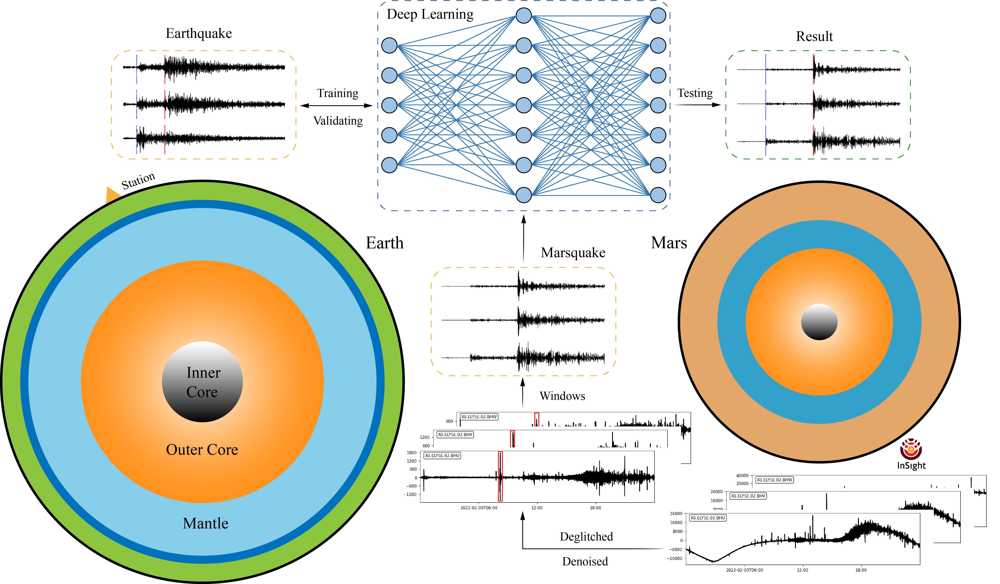

# MarsConvNet: Marsquakes detection of InSight seismic data using deep learning



## STanford EArthquake Dataset (STEAD):

### 1. Download:

Each of the following files contains one hdf5 (data) and one CSV (metadata) files for ~ 200k 3C waveforms. You can download the chunks you need and then merge them into a single file using the provided code in **./datas/.**

* [STanford EArthquake Dataset chunk1](https://drive.google.com/file/d/1sgLd3eVIrTMcuWtOQRN1fGmiNQ7vc227/view) (~ 14.6 GB, Noise)
* [STanford EArthquake Dataset chunk2](https://drive.google.com/file/d/1ONNNtiOwFodAAeV-ZWp_-gtWhRcYgU_E/view) (~ 13.7 GB, Local Earthquakes)
* [STanford EArthquake Dataset chunk3](https://drive.google.com/file/d/15bt3WS-mQJmkVY4VOb5LYk45xQBYtkoM/view) (~ 13.7 GB, Local Earthquakes)
* [STanford EArthquake Dataset chunk4](https://drive.google.com/file/d/12Rw-WI9T21g0hrqtF1KiETYzV4rz177k/view) (~ 13.7 GB, Local Earthquakes)
* [STanford EArthquake Dataset chunk5](https://drive.google.com/file/d/1rR6bbqu1yE8N_EVIb3kH3wzPPVLFerFX/view) (~ 13.7 GB, Local Earthquakes)
* [STanford EArthquake Dataset chunk6](https://drive.google.com/file/d/1QfONZf8TBuQlkvKjwJgVMgZub4RDUkH9/view) (~ 15.7 GB, Local Earthquakes)

Unzip the downloaded chunks and put them into **./datas/hdf5/**.

`chunk1.csv,chunk2.csv,chunk3.csv,chunk4.csv,chunk5.csv,chunk6.csv` into **./datas/hdf5/csv/**.

`chunk1.hdf5,chunk2.hdf5,chunk3.hdf5,chunk4.hdf5,chunk5.hdf5,chunk6.hdf5` into **./datas/hdf5/data/**.

Use `cd ./datas` and run `python data_maker.py` to obtain the training set, testing set and valid set in **./datas/npy/**.

### 2. Train

* Run `python train.py`, the trained model is saved in **./snapshots/**. The evaluation indexes with the training epochs in training process is saved in **./evals/**. The training loss function and testing loss function with the training epochs in training process are saved in **./loss/**.
* Run `python plot.py`, images are saved in **./images/**.

### 3. Test

* Run `python test.py`, the evaluation indexs in the testing process is saved in **./evals_test/**. Use the following code to display the evaluation results.

  ```
  import numpy as np

  input_file = './evals_test/evals.npy'
  evals = np.load(input_file, allow_pickle=True)
  print('\nPrecision: %s' %evals[0])
  print('\nRecall: %s' %evals[1])
  print('\nF-score: %s' %evals[2])
  print('\nMean: %s' %evals[3])
  print('\nStd: %s' %evals[4])
  print('\nMSE: %s' %evals[5])
  print('\nRMSE: %s' %evals[6])
  print('\nMAE: %s' %evals[7])
  print('\nMAPE: %s' %evals[8])
  ```
* Run `python test_img.py`, the tested images are saved in **./results_img/**.

## Marsquake Service (MQS):

* Use `cd ./mars_test` into the **./mars_test/**, run `python test2022.py` to obtain the detected results for 2022.

## Reference:

* Marsquakes detection of InSight seismic data using deep learning, 2023.
