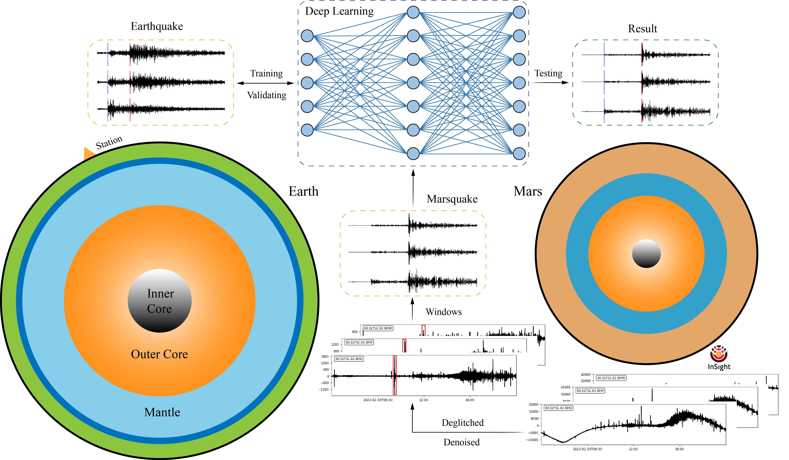

# MarsConvNet: Marsquakes detection of InSight seismic data using deep learning

## STanford EArthquake Dataset (STEAD):

### 1. Download:

Each of the following files contains one hdf5 (data) and one CSV (metadata) files for ~ 200k 3C waveforms. You can download the chunks you need and then merge them into a single file using the provided code in **./datas/.**

* [STanford EArthquake Dataset chunk1](https://drive.google.com/file/d/1sgLd3eVIrTMcuWtOQRN1fGmiNQ7vc227/view) (~ 14.6 GB, Noise)
* [STanford EArthquake Dataset chunk2](https://drive.google.com/file/d/1ONNNtiOwFodAAeV-ZWp_-gtWhRcYgU_E/view) (~ 13.7 GB, Local Earthquakes)
* [STanford EArthquake Dataset chunk3](https://drive.google.com/file/d/15bt3WS-mQJmkVY4VOb5LYk45xQBYtkoM/view) (~ 13.7 GB, Local Earthquakes)
* [STanford EArthquake Dataset chunk4](https://drive.google.com/file/d/12Rw-WI9T21g0hrqtF1KiETYzV4rz177k/view) (~ 13.7 GB, Local Earthquakes)
* [STanford EArthquake Dataset chunk5](https://drive.google.com/file/d/1rR6bbqu1yE8N_EVIb3kH3wzPPVLFerFX/view) (~ 13.7 GB, Local Earthquakes)
* [STanford EArthquake Dataset chunk6](https://drive.google.com/file/d/1QfONZf8TBuQlkvKjwJgVMgZub4RDUkH9/view) (~ 15.7 GB, Local Earthquakes)

Unzip the downloaded chunks and put them into **./datas/hdf5/**.

`chunk1.csv,chunk2.csv,chunk3.csv,chunk4.csv,chunk5.csv,chunk6.csv` into **./datas/hdf5/csv/**.

`chunk1.hdf5,chunk2.hdf5,chunk3.hdf5,chunk4.hdf5,chunk5.hdf5,chunk6.hdf5` into **./datas/hdf5/data/**.

Use `cd ./datas` and run `python data_maker.py` to obtain the training set, testing set and valid set in **./datas/npy/**.

## Reference:

* MarsConvNet: Marsquakes detection of InSight seismic data using deep learning, 2023.
